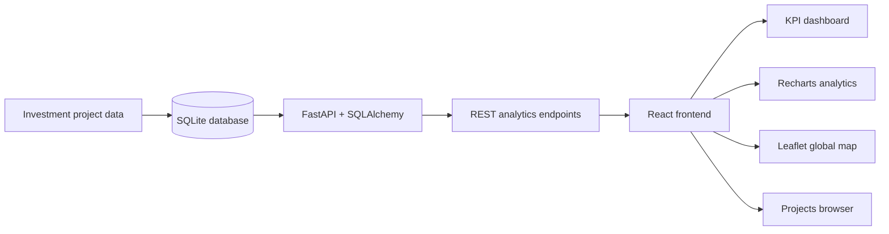

# FDI Lens

**FDI Lens** is a full-stack foreign direct investment intelligence platform for exploring global greenfield investment activity through interactive analytics, maps, trends, and a searchable project browser.

> **Portfolio/demo project:** the current application uses synthetic data generated for demonstration purposes. The architecture is designed so the demo dataset can later be replaced by validated public or licensed FDI data sources.

## What the application does

FDI Lens turns structured investment-project data into an interactive decision-support dashboard. It allows a user to explore where investment is flowing, which sectors are attracting capital, how activity changes over time, and which projects sit behind the headline metrics.

### Current features

- Executive KPI cards for total projects, capital investment, jobs created, and destination-country coverage
- Top destination-country analysis
- Sector analysis ranked by capital investment
- Monthly investment trends with switchable project, capex, and jobs metrics
- Interactive global investment map
- Searchable and filterable investment-project browser
- Server-side filtering, sorting, and pagination
- REST API built with FastAPI
- Relational data model using SQLAlchemy and SQLite
- React frontend with Recharts and Leaflet
- GitHub Actions CI for frontend lint/build checks and backend validation

## Why I built it

Investment datasets can be difficult to interpret when they are viewed only as spreadsheets or raw records. FDI Lens demonstrates how a software application can combine data modelling, APIs, analytics, and visualisation to turn investment records into a more usable intelligence product.

The project is also a practical full-stack engineering exercise covering:

- backend API design;
- relational data modelling;
- frontend state and API integration;
- analytical aggregation;
- data visualisation;
- geographic visualisation;
- CI automation; and
- iterative development through GitHub pull requests.

## Architecture



## Technology stack

| Layer | Technologies |
| --- | --- |
| Frontend | React 19, Vite, Axios |
| Visualisation | Recharts, Leaflet, React Leaflet |
| Backend | Python, FastAPI |
| Data | SQLAlchemy, SQLite |
| Demo data | Faker + synthetic FDI records |
| Quality | Oxlint, Python compile/import checks |
| CI | GitHub Actions |

## API capabilities

The backend currently exposes endpoints for:

| Endpoint | Purpose |
| --- | --- |
| `GET /api/projects` | Browse investment projects with filters, sorting, and pagination |
| `GET /api/analytics/summary` | Headline portfolio metrics |
| `GET /api/analytics/top-destinations` | Rank destination countries |
| `GET /api/analytics/top-sources` | Rank source countries |
| `GET /api/analytics/top-sectors` | Rank sectors |
| `GET /api/analytics/trends` | Monthly investment trends |
| `GET /api/analytics/map` | Aggregated geographic investment data |

Project queries support filters including destination country, source country, sector, date range, capital expenditure, project type, and company name.

## Repository structure

```text
fdi-lens/
├── backend/
│   └── app/
│       ├── main.py
│       ├── models.py
│       ├── database.py
│       ├── create_db.py
│       └── seed.py
├── frontend/
│   └── src/
│       ├── components/
│       ├── services/
│       └── App.jsx
├── .github/
│   └── workflows/
│       └── ci.yml
└── README.md
```

## Run locally

### 1. Start the backend

From the repository root:

```bash
cd backend
python -m venv .venv
```

Activate the virtual environment, then install dependencies:

```bash
pip install -r requirements.txt
python -m app.create_db
python -m app.seed
uvicorn app.main:app --reload
```

The API will be available at:

```text
http://127.0.0.1:8000
```

FastAPI's interactive API documentation will be available at:

```text
http://127.0.0.1:8000/docs
```

### 2. Start the frontend

In a second terminal:

```bash
cd frontend
npm install
```

Create a local `.env` file using `.env.example`:

```env
VITE_API_URL=http://127.0.0.1:8000
```

Then run:

```bash
npm run dev
```

## Engineering practices demonstrated

This repository is intentionally developed as an engineering portfolio project rather than a one-file demo. It includes:

- separation between frontend, backend, and data layers;
- parameterised API filtering and pagination;
- reusable frontend API services;
- explicit environment configuration;
- automated CI checks on pushes and pull requests;
- linting and production build validation for the frontend; and
- backend compile and application-import checks.

## Current status

The core full-stack dashboard is functional with synthetic demonstration data. Current capabilities include analytics, trends, mapping, and project browsing.

## Next improvements

Planned extensions include:

- deployment of the frontend and API;
- automated tests for API behaviour and frontend components;
- PostgreSQL support for a production-style deployment;
- ingestion of validated public FDI datasets;
- richer country and company drill-down views; and
- exportable analytical reports.

---

Built as a portfolio project to demonstrate practical full-stack software development, API design, analytics, and data visualisation.
