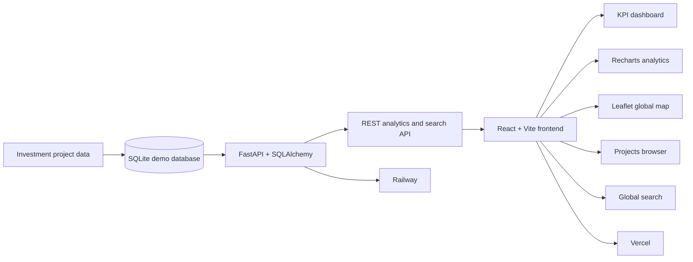

# FDI Lens

**FDI Lens** is a full-stack foreign direct investment intelligence platform for exploring global greenfield investment activity through interactive analytics, maps, trends, global search, and a searchable project browser.

> **Portfolio/demo project:** the current application uses synthetic data generated for demonstration purposes. The architecture is designed so the demo dataset can later be replaced by validated public or licensed FDI data sources.

## Live application

- **Frontend:** https://fdi-lens.vercel.app
- **Backend API:** https://fdi-lens-api-production.up.railway.app
- **Interactive API docs:** https://fdi-lens-api-production.up.railway.app/docs
- **Health check:** https://fdi-lens-api-production.up.railway.app/health

The frontend is deployed on **Vercel** and the FastAPI backend is deployed on **Railway**.

## What the application does

FDI Lens turns structured investment-project data into an interactive decision-support dashboard. It allows a user to explore where investment is flowing, which sectors are attracting capital, how activity changes over time, and which projects sit behind the headline metrics.

### Current features

- Executive KPI cards for total projects, capital investment, jobs created, and destination-country coverage
- Top destination-country analysis
- Sector analysis ranked by capital investment
- Monthly investment trends with switchable project, capex, and jobs metrics
- Interactive global investment map using country-level reference coordinates
- Global search across projects, companies, countries, sectors, and project descriptions
- `Ctrl + K` keyboard shortcut for global search
- Searchable and filterable investment-project browser
- Project-detail modal for individual investment records
- Server-side filtering, sorting, and pagination
- REST API built with FastAPI
- Relational data model using SQLAlchemy and SQLite
- React frontend with Recharts and Leaflet
- GitHub Actions CI for frontend lint/build checks and backend validation
- Production deployment using Vercel and Railway

## Why I built it

Investment datasets can be difficult to interpret when they are viewed only as spreadsheets or raw records. FDI Lens demonstrates how a software application can combine data modelling, APIs, analytics, and visualisation to turn investment records into a more usable intelligence product.

The project is also a practical full-stack engineering exercise covering:

- backend API design;
- relational data modelling;
- frontend state and API integration;
- analytical aggregation;
- data visualisation;
- geographic visualisation;
- search and discovery;
- CI automation;
- cloud deployment; and
- iterative development through GitHub pull requests.

## Architecture



## Technology stack

| Layer | Technologies |
| --- | --- |
| Frontend | React 19, Vite, Axios |
| Visualisation | Recharts, Leaflet, React Leaflet |
| Backend | Python, FastAPI |
| Data | SQLAlchemy, SQLite |
| Demo data | Faker + synthetic FDI records |
| Search | FastAPI + SQLAlchemy query layer |
| Quality | Oxlint, Python compile/import checks |
| CI | GitHub Actions |
| Deployment | Vercel, Railway |

## API capabilities

The live backend currently exposes:

| Endpoint | Purpose |
| --- | --- |
| `GET /` | API welcome endpoint |
| `GET /health` | Deployment health check |
| `GET /api/search?q={query}` | Global search across FDI data |
| `GET /api/projects` | Browse investment projects with filters, sorting, and pagination |
| `GET /api/analytics/summary` | Headline portfolio metrics |
| `GET /api/analytics/top-destinations` | Rank destination countries |
| `GET /api/analytics/top-sources` | Rank source countries |
| `GET /api/analytics/top-sectors` | Rank sectors |
| `GET /api/analytics/trends` | Monthly investment trends |
| `GET /api/analytics/map` | Aggregated geographic investment data |

Project queries support filters including destination country, source country, sector, date range, capital expenditure, project type, and company name.

Global search returns grouped results for projects, companies, countries, and sectors.

## Production deployment

The production architecture is:

```text
GitHub
  |
  +-- frontend/  --> Vercel
  |                 https://fdi-lens.vercel.app
  |
  +-- backend/   --> Railway
                    https://fdi-lens-api-production.up.railway.app
```

The frontend uses:

```env
VITE_API_URL=https://fdi-lens-api-production.up.railway.app
```

The backend uses a configurable CORS origin through:

```env
FRONTEND_ORIGINS=https://fdi-lens.vercel.app
```

### Deployment data note

The current cloud deployment intentionally uses the synthetic SQLite demo dataset so the portfolio application can run with minimal infrastructure. The database is created and seeded when the backend environment starts.

For a more production-oriented version, the next database step is to migrate persistence to PostgreSQL.

## Repository structure

```text
fdi-lens/
├── backend/
│   ├── main.py
│   ├── requirements.txt
│   └── app/
│       ├── main.py
│       ├── models.py
│       ├── database.py
│       ├── create_db.py
│       ├── seed.py
│       ├── country_coordinates.py
│       └── update_country_coordinates.py
├── frontend/
│   └── src/
│       ├── components/
│       │   ├── GlobalSearch.jsx
│       │   ├── InvestmentMap.jsx
│       │   └── projects/
│       ├── services/
│       │   └── api.js
│       └── App.jsx
├── .github/
│   └── workflows/
│       └── ci.yml
└── README.md
```

## Run locally

### 1. Start the backend

From the repository root:

```bash
cd backend
python -m venv .venv
```

Activate the virtual environment, then install dependencies:

```bash
pip install -r requirements.txt
python -m app.create_db
python -m app.seed
uvicorn app.main:app --reload
```

The API will be available at:

```text
http://127.0.0.1:8000
```

FastAPI's interactive API documentation will be available at:

```text
http://127.0.0.1:8000/docs
```

### 2. Start the frontend

In a second terminal:

```bash
cd frontend
npm install
```

Create a local `.env` file using `.env.example`:

```env
VITE_API_URL=http://127.0.0.1:8000
```

Then run:

```bash
npm run dev
```

## Engineering practices demonstrated

This repository is intentionally developed as an engineering portfolio project rather than a one-file demo. It includes:

- separation between frontend, backend, and data layers;
- parameterised API filtering and pagination;
- reusable frontend API services;
- debounced global search;
- explicit environment configuration;
- automated CI checks on pushes and pull requests;
- linting and production build validation for the frontend;
- backend compile and application-import checks;
- production CORS configuration;
- health-check support for cloud hosting; and
- separate frontend and backend cloud deployment.

## Current status

The full-stack portfolio application is live and functional with synthetic demonstration data.

Current capabilities include:

- analytics dashboard;
- time-series trends;
- interactive global map;
- global search;
- project filtering and pagination;
- project-detail views;
- live FastAPI documentation;
- GitHub Actions CI; and
- public cloud deployment.

## Next improvements

Planned extensions include:

- PostgreSQL support for durable production-style persistence;
- automated API and frontend component tests;
- ingestion of validated public FDI datasets;
- richer country and company drill-down views;
- exportable analytical reports;
- improved accessibility and keyboard navigation for global search; and
- stale-request protection for rapid search queries.

---

Built as a portfolio project to demonstrate practical full-stack software development, API design, analytics, search, data visualisation, CI/CD, and cloud deployment.
